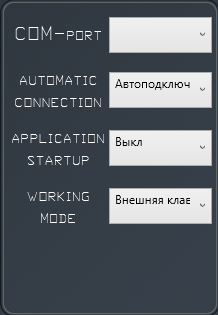
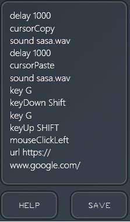

Sibia Macro Keyboard - Решение для написания макросов
============================================================================
Приложение представляет собой простой, но при этом многофункциональный инструмент для написания макросов на платформе Windows с возможностью подключения внешней клавиатуры. Используя данное решение вы получаете следующие функциональные возможности: 
- Полное управление мышью (перемещение курсора, нажатие клавиш с возможностью удержания клавиши, вертикальный и горизонтальный скролл)
- Полное управление клавиатурой (нажатие клавиш с возможностью удержания, комбинация из нескольких нажатий)
- Возможность открывать файлы на компьютере и управление каталогами
- Возможность перехода по внешним URL ссылкам
- Воспроизведение звуков и многое другое

Интерфейс
------

Интерфейс состоит из 12 программируемых кнопок, текстового поля и элементов управления
- Чтобы назначить на кнопку макрос, необходимо нажать на неё ЛКМ, в текстовом поле справа составить список команд (см. ниже) и нажать на кнопку SAVE. Макрос запишется в память компьютера. Чтобы откурыть справку, нажмите на кнопку HELP.
- Чтобы открыть настройки - нажмите на шестеренку в верхнем правом углу.
- Стрелка вниз сворачивает приложение в системный трей. Чтобы развернуть приложение необходимо найти на панели задач значок приложения и кликнуть по нему ЛКМ.
- Стрелка вверх закрывает приложение. Аналогичное действие можно сделать кликнув по значку в трее ПКМ и выбрав соответствующий пункт.
 

Настройки
-------------
Чтобы открыть меню настроек кликните по шестеренке в правом верхнем углу
- COM-port - выбор порта USB, куда подключена внешняя макро-клавиатура
- Automatic сonnection - если активировать, то при следующем запуске произойдет автоматическое подключение к последнему выбранному порту
- Application startup - позволяет добавить приложение в автозагрузку (открыть окно или запустить в фоне), а так же удаляет его из автозагрузки
- Working mode - Выбор режима работы (режим с внешней клавиатурой, когда кнопки макроса в приложении не активны и режим с виртуальной клавиатурой, когда кнопки становятся активными, а окно отображается поверх других окон Windows).
 

Подключение внешней клавиатуры
-------------
Клавиатура подключается в разъем USB компьютера, затем необходимо установить драйвер CH340G, если он не установлен (installer приложения предлагает его установку). Затем необходимо выбрать порт в настройках. Клавиатура полностью готова к работе

Написание макросов
-------------
Синтаксис написания команд для макросов имеет следующий вид: ```[команда]_[параметр]```где знак нижнего подчеркивания ( _ ) означает пробел, 
а квадратные скобки нарисованы для наилучшего понимания. Некоторые команды принимают 2 параметра и имеют следующий вид: 
```[команда]_[первый параметр]_[второй параметр]```. Так же есть команды, которые не принимают параметров и имеют следующий вид: ```[команда]```
Рассмотрим три примера реального написания команд для макроса: слева вид реального синтаксиса, справа - его схема и описание

- `keyDown SHIFT`                 [keyDown] - это команда, а [SHIFT] - это параметр.
- `keySerial 10 TAB`             [keySerial] - это команда, [10] - первый параметр, [TAB] - второй параметр
- `mouseLeftDown`                 [mouseLeftDown] - это команда, параметры отсутствуют

 

Команды не имеют жесткой привязки к регистру, поэтому `keyDown` и `KeYdOwN` - условно выполнят одну и ту же функцию, но для лучшего понимания написанного
текста всё же стоит соблюдать регистр команд, приведенный в данном руководстве. После последнего параметра (если он имеется) не должно быть никаких символов, 
в том числе и пробела. Команды разделяются построчно (нажатием ENTER. Новая строка - новая команда)

Чтобы сохранить написанный макрос, необходимо нажать на кнопку SAVE, которая располагается снизу от текстового редактора макросов. Данный макрос будет
назначен на определенную клавишу  и записан в память компьютера. Чтобы открыть эту инструкцию, необходимо нажать на кнопку HELP, которая располагается рядом


Список команд:
------------
- `key` -       Принимает 1 параметр, выполняет однократное нажатие (без удерживания) клавиши, которая передана в качестве параметра 
            Например: `key G` - один раз (без удерживания) будет нажата клавиша G

- `keyDown` -   Принимает 1 параметр, выполняет нажатие переданной в качестве параметра клавиши с её удержанием в нижнем положении. Обычно применяется для
            нажатия таких клавиш, как SHIFT и полностью повторяет их функционал на обычной клавиатуре. Например: `keyDown SHIFT`

- `keyUp` -     Принимает 1 параметр, возвращает в исходное состояние клавишу, которая была передана в качестве параметра. Например: `keyUp SHIFT`

- `text` -      В качестве параметра принимает строку текста, которая может иметь пробелы в любых местах, в том числе, в конце самой строки. Выполняет
            ввод текста, переданного в качестве параметра. Например: `text Привет, как дела?`

- `keySeries` - Принимает 2 параметра: первый - целое число, второй - клавиша. Выполняет нажатие на клавишу, которая передана в качестве второго параметра 
 		столько раз, сколько было передано в качестве первого параметра. Максимальное число повторений за одну команду: 99
 	      Например: `keySeries 10 G` - десять раз будет нажата клавиша G

- `mouseClickLeft` -         Не принимает параметров. Выполняет однократное нажатие ЛКМ (без удерживания)

- `mouseDownLeft` -          Не принимает параметров. Выполняет нажатие ЛКМ с её удержанием

- `mouseUpLeft` -            Не принимает параметров. Возвращает ЛКМ в исходное состояние

- `mouseDoubleClickLeft` -   Не принимает параметров. Выполняет двойное нажатие ЛКМ

- `mouseClickRight` -        Не принимает параметров. Выполняет однократное нажатие ПКМ (без удерживания)

- `mouseDownRight` -         Не принимает параметров. Выполняет нажатие ПКМ с её удержанием

- `mouseUpRight` -           Не принимает параметров. Возвращает ПКМ в исходное состояние

- `mouseDoubleClickRight` -  Не принимает параметров. Выполняет двойное нажатие ПКМ

- `vertScroll` -    Принимает 1 параметр, выполняет вертикальное пролистывание на количество единиц, переданных в качестве параметра. Например: `vertScroll 10`

- `horScroll` -     Принимает 1 параметр, выполняет горизонтальное пролистывание на количество единиц, переданных в качестве параметра. Например: `horScroll 10`

- `cursor` -        Принимает 2 параметра: координаты X (горизонталь) и Y (вертикаль), в которые затем перемещает курсор мыши на экране. 
                Например: `Cursor 1920 1080`.
                
Для облегчения поиска необходимых координат мыши вы можете воспользоваться функцией автоматического определения положения курсора. Для этого поставьте курсор на новую строку в области ввода текста макроса, затем переместите мышь в необходимое положение на экране и нажмите клавишу F1 на вашей клавиатуре. Произойдет автоматический ввод команды и её параметров

- `cursorCopy` - Не принимает параметров. Копирует текущее положение курсора в буфер обмена

- `cursorPaste` - Перемещает курсор в положение из буфера (если буфер пустой, положение курсора будет иметь координаты {0,0}

- `delay` -    Принимает 1 параметр. Приостанавливает выполнение макроса на заданное количество миллисекунд (1 сек = 1000 мс). Функционально приостанавливает
           поток, в котором выполняется макрос. Например: `delay 1000`

- `start` -    Принимает 1 параметр, в качестве которого выступает полный путь до исполнямого файла. Запускает процесс по указанному пути. Может открывать 
	     приложения, папки, файлы и т.д., чтобы скопировать путь до файла, необходимо нажать на файл правой кнопкой мыши (ПКМ) и выбрать пункт контекстног
	     меню "копировать как путь". Затем этот путь в неизменном виде можно вставить в текст макроса. 
	     Например: `start "C:\Users\Erzchan\Desktop\image.png"`

- `url` -      Принимает 1 параметр, в качестве которого выступает ссылка на сайт. Ссылка должна начинаться с протокола соединения. Переходит по указанной ссылке
	     в браузере, который установлен как браузер по умолчанию в системе (любой). Например: `url https://www.google.com/`

- `sound` -    Принимает 1 параметр (имя файла) и воспроизводит звук в формате wav, взятый из корневой папки исполняемого файла программы. Файлы можно добавлять
	     вручную, присваивать им имя, а затем вызывать его при помощи этой команды и параметра. 
	     Например: `sound beep.wav`


Дополнительная информация
============
Язык написания приложения: C#
Фреймворк: .NET Framework 4.8
Целевая платформа: Windows
Архитектура приложения: x64
